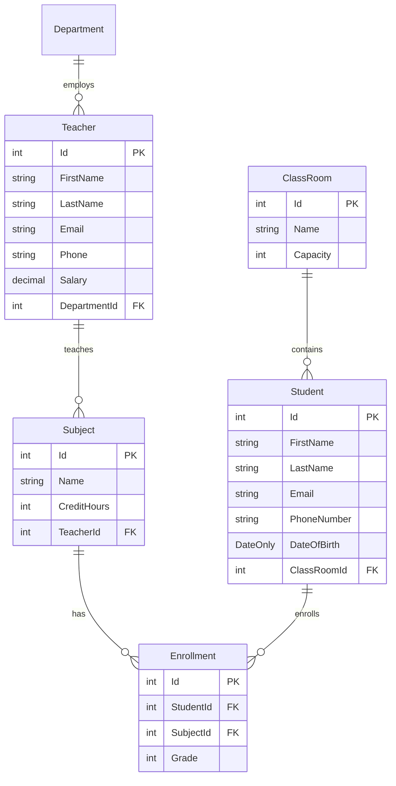

# 🏫 School Management System API

[](https://dotnet.microsoft.com/)
[](https://docs.microsoft.com/ef/core/)
[](https://automapper.org/)
[](https://swagger.io/)

A modern, robust RESTful Web API for managing school entities (Students, Teachers, Departments, Subjects, ClassRooms, and Enrollments) built with **ASP.NET Core Web API (.NET 8)**, **Entity Framework Core**, and **AutoMapper**.

---

## 📑 Table of Contents
1. [Installed Packages & Dependencies](#-installed-packages--dependencies)
2. [Database Entities Overview](#-database-entities-overview)
3. [AutoMapper & Object Mapping Guide](#-automapper--object-mapping-guide)
   - [Current Mapping Setup in the Project](#current-mapping-setup-in-the-project)
   - [Recommended Setup (Dependency Injection)](#recommended-setup-via-dependency-injection)
   - [How to Combine First & Last Name into FullName](#-how-to-combine-firstname--lastname-into-fullname)
4. [Master LINQ Operations Reference](#-master-linq-operations-reference)
   - [Quick Comparison Cheat Sheets](#quick-comparison-cheat-sheets)
   - [1. Projection Operations (`Select`, `SelectMany`)](#1-projection-operations)
   - [2. Filtering / Restriction Operations (`Where`, `OfType`)](#2-filtering--restriction-operations)
   - [3. Element Operations (`First`, `FirstOrDefault`, `Single`, `SingleOrDefault`, `Last`)](#3-element-operations)
   - [4. Quantifier Operations (`Any`, `All`, `Contains`)](#4-quantifier-operations)
   - [5. Sorting / Ordering Operations (`OrderBy`, `ThenBy`, `Reverse`)](#5-sorting--ordering-operations)
   - [6. Grouping Operations (`GroupBy`)](#6-grouping-operations)
   - [7. Aggregation Operations (`Count`, `Sum`, `Average`, `Min`, `Max`)](#7-aggregation-operations)
   - [8. Set Operations (`Distinct`, `Union`, `Intersect`, `Except`)](#8-set-operations)
   - [9. Materialization & Execution (`ToList`, `ToArray`, Deferred vs Immediate)](#9-materialization--execution-operations)
5. [Getting Started & Run](#-getting-started--run)

---

## 📦 Installed Packages & Dependencies

The project is built on **.NET 8 (`net8.0`)** and uses the following NuGet packages:

| Package Name | Installed Version | Purpose / Role |
| :--- | :---: | :--- |
| `AutoMapper.Extensions.Microsoft.DependencyInjection` | `12.0.0` | Provides AutoMapper integration with ASP.NET Core Dependency Injection for mapping Entities to DTOs. |
| `Microsoft.EntityFrameworkCore.SqlServer` | `8.0.2` | Entity Framework Core provider for Microsoft SQL Server / LocalDB. |
| `Microsoft.EntityFrameworkCore.Tools` | `8.0.2` | EF Core CLI & Package Manager Console tools for migrations (`Add-Migration`, `Update-Database`). |
| `Swashbuckle.AspNetCore` | `6.6.2` | Generates Swagger / OpenAPI 3.0 documentation and interactive testing UI. |

### CLI Installation Commands
If setting up a new project or restoring packages manually:
```bash
dotnet add package AutoMapper.Extensions.Microsoft.DependencyInjection --version 12.0.0
dotnet add package Microsoft.EntityFrameworkCore.SqlServer --version 8.0.2
dotnet add package Microsoft.EntityFrameworkCore.Tools --version 8.0.2
dotnet add package Swashbuckle.AspNetCore --version 6.6.2
```

---

## 🏛 Database Entities Overview

To understand the LINQ and Mapping examples below, here are the main entities in the School project:



---

## 🔄 AutoMapper & Object Mapping Guide

### Current Mapping Setup in the Project
The project uses **AutoMapper Profiles** located under the `Mapping/` directory:
- `StudentProfile.cs`
- `TeacherProfile.cs`
- `DepartmentProfile.cs`
- `SubjectProfile.cs`
- `ClassRoomProfile.cs`
- `EnrollmentProfile.cs`

#### Example Profile (`StudentProfile.cs`):
```csharp
using AutoMapper;
using School.Models;
using SchoolProjcet.DTO.StudentDTOs;

namespace SchoolProjcet.Mapping
{
    public class StudentProfile : Profile
    {
        public StudentProfile()
        {
            // Two-way mapping between Entity and DTOs
            CreateMap<Student, StudentDTO>().ReverseMap();
            CreateMap<Student, CreateStudentDTO>().ReverseMap();
            CreateMap<Student, UpdateStudentDTO>().ReverseMap();
        }
    }
}
```

#### In the Controllers:
Currently, the controller instantiates the mapper directly in the constructor:
```csharp
private readonly AppDbContext _context;
private readonly IMapper _mapper;

public StudentsController()
{
    _context = new AppDbContext();
    _mapper = new MapperConfiguration(cfg => cfg.AddProfile<StudentProfile>()).CreateMapper();
}

[HttpGet]
public IActionResult GetAll()
{
    var students = _context.Students.Include(e => e.ClassRoom).ToList();
    var studentDTOs = _mapper.Map<List<StudentDTO>>(students);
    return Ok(studentDTOs);
}
```

---

### Recommended Setup via Dependency Injection
Instead of calling `new MapperConfiguration(...)` inside every controller, register AutoMapper once in `Program.cs`:

#### 1. In `Program.cs`:
```csharp
// Register all profiles in the current assembly automatically
builder.Services.AddAutoMapper(typeof(Program).Assembly);
```

#### 2. In Controllers (Inject `IMapper`):
```csharp
[Route("api/[controller]")]
[ApiController]
public class StudentsController : ControllerBase
{
    private readonly AppDbContext _context;
    private readonly IMapper _mapper;

    public StudentsController(AppDbContext context, IMapper mapper)
    {
        _context = context;
        _mapper = mapper;
    }
}
```

---

### 🌟 How to Combine `FirstName` & `LastName` into `FullName`

When your entity has separate `FirstName` and `LastName` properties and your DTO needs a combined `FullName`, you have 3 clean approaches:

#### Approach 1: AutoMapper `ForMember` with `MapFrom` *(Most Popular)*

**1. Update your DTO:**
```csharp
namespace SchoolProjcet.DTO.StudentDTOs
{
    public class StudentDTO
    {
        public int Id { get; set; }
        public string FullName { get; set; } = string.Empty; // Combined
        public string Email { get; set; } = string.Empty;
        public string? PhoneNumber { get; set; }
        public DateOnly DateOfBirth { get; set; }
        public string? ClassRoomName { get; set; }
    }
}
```

**2. Configure the mapping in `StudentProfile.cs`:**
```csharp
using AutoMapper;
using School.Models;
using SchoolProjcet.DTO.StudentDTOs;

namespace SchoolProjcet.Mapping
{
    public class StudentProfile : Profile
    {
        public StudentProfile()
        {
            CreateMap<Student, StudentDTO>()
                // Combine FirstName and LastName into FullName
                .ForMember(dest => dest.FullName, opt => opt.MapFrom(src => $"{src.FirstName} {src.LastName}"))
                // Map navigation property ClassRoom.Name into ClassRoomName
                .ForMember(dest => dest.ClassRoomName, opt => opt.MapFrom(src => src.ClassRoom != null ? src.ClassRoom.Name : null));

            // Reverse map if needed (splitting FullName back into FirstName / LastName)
            CreateMap<StudentDTO, Student>()
                .ForMember(dest => dest.FirstName, opt => opt.MapFrom(src => src.FullName.Split(' ', 2)[0]))
                .ForMember(dest => dest.LastName, opt => opt.MapFrom(src => src.FullName.Contains(' ') ? src.FullName.Split(' ', 2)[1] : ""));
        }
    }
}
```

---

#### Approach 2: LINQ Projection (`.Select()`) *(Best Performance with Database)*
When querying via EF Core, projecting directly inside `.Select()` translates the string concatenation into SQL (`FirstName + ' ' + LastName`), so SQL Server performs the concatenation and avoids fetching unneeded columns:

```csharp
[HttpGet("with-fullname")]
public IActionResult GetStudentsWithFullName()
{
    var students = _context.Students
        .Select(s => new StudentDTO
        {
            Id = s.Id,
            FullName = s.FirstName + " " + s.LastName, // Translated to SQL concat
            Email = s.Email,
            PhoneNumber = s.PhoneNumber,
            DateOfBirth = s.DateOfBirth,
            ClassRoomName = s.ClassRoom != null ? s.ClassRoom.Name : null
        })
        .ToList();

    return Ok(students);
}
```

---

#### Approach 3: Computed Property on Entity or DTO *(Zero Configuration)*
You can define a read-only calculated property directly inside `Student.cs` or `StudentDTO.cs`:

```csharp
// Inside Student.cs (Entity) or StudentDTO.cs (DTO)
[NotMapped] // If inside Entity so EF Core doesn't try to create a DB column
public string FullName => $"{FirstName} {LastName}".Trim();
```

---

## ⚡ Master LINQ Operations Reference

LINQ (Language Integrated Query) methods are grouped by standard operation types.

### Quick Comparison Cheat Sheets

#### 🔍 Element Operations Comparison
| Method | Sequence is Empty | Single Matching Item | Multiple Matching Items | EF Core SQL Translation |
| :--- | :--- | :--- | :--- | :--- |
| **`.First()`** | ❌ Throws `InvalidOperationException` | ✅ Returns item | ✅ Returns **first** item | `SELECT TOP(1) ...` |
| **`.FirstOrDefault()`** | ✅ Returns `null` / `default` | ✅ Returns item | ✅ Returns **first** item | `SELECT TOP(1) ...` |
| **`.Single()`** (`.One()`) | ❌ Throws `InvalidOperationException` | ✅ Returns item | ❌ Throws `InvalidOperationException` | `SELECT TOP(2) ...` |
| **`.SingleOrDefault()`** | ✅ Returns `null` / `default` | ✅ Returns item | ❌ Throws `InvalidOperationException` | `SELECT TOP(2) ...` |
| **`.Last()`** | ❌ Throws `InvalidOperationException` | ✅ Returns item | ✅ Returns **last** item | In-memory or reversed `ORDER BY` |
| **`.LastOrDefault()`** | ✅ Returns `null` / `default` | ✅ Returns item | ✅ Returns **last** item | In-memory or reversed `ORDER BY` |

> [!IMPORTANT]
> **What is `.One()`?**
> Standard C# LINQ does not have a method literally named `.One()`. The standard LINQ method for finding **exactly one element** is **`.Single()`** or **`.SingleOrDefault()`**. If you are looking for only 1 item at most, use `.SingleOrDefault()` (which enforces uniqueness) or `.FirstOrDefault()` (which takes the first match).

---

#### ⚖️ Quantifier Operations Comparison
| Method | Purpose | Return Type | Translates to SQL |
| :--- | :--- | :---: | :--- |
| **`.Any()`** | Checks if **at least one** element exists (or satisfies predicate) | `bool` | `EXISTS (SELECT 1 ...)` |
| **`.All()`** | Checks if **every single** element satisfies predicate | `bool` | `NOT EXISTS (SELECT 1 ... WHERE NOT ...)` |
| **`.Contains()`** | Checks if sequence contains a specific value | `bool` | `WHERE [col] IN (...)` |

---

### 1. Projection Operations

Projection transforms elements of a collection into a new shape (e.g. projecting an Entity into a DTO or anonymous object).

#### 🔹 `.Select()`
Transforms each item into a new form.

- **Return Type**: `IQueryable<TResult>` / `IEnumerable<TResult>`
- **When to Use**:
  - Selecting a subset of columns from the database (saves memory and bandwidth).
  - Creating DTOs directly from entities.
  - Transforming data formats (e.g., extracting emails, formatting dates).

```csharp
// Example: Select only Id and FullName into anonymous object
var studentNames = _context.Students
    .Select(s => new {
        s.Id,
        FullName = s.FirstName + " " + s.LastName
    })
    .ToList();

// Example: Map directly into StudentDTO in database query
var dtos = _context.Students
    .Select(s => new StudentDTO {
        Id = s.Id,
        FirstName = s.FirstName,
        LastName = s.LastName,
        ClassRoomName = s.ClassRoom.Name
    })
    .ToList();
```

---

#### 🔹 `.SelectMany()`
Projects each element to a collection and **flattens** the resulting nested collections into a single one-dimensional sequence.

- **Return Type**: `IQueryable<TResult>` / `IEnumerable<TResult>`
- **When to Use**:
  - Flattening one-to-many relationships (e.g., getting all enrollments across a list of students).
  - Unnesting collections of child lists into one flat list.

```csharp
// Example: Extract a flat list of all enrollments from all active students
List<Enrollment> allEnrollments = _context.Students
    .SelectMany(student => student.Enrollments)
    .ToList();

// Example: Get all distinct subject names taken by students in classroom 1
var subjectNames = _context.Students
    .Where(s => s.ClassRoomId == 1)
    .SelectMany(s => s.Enrollments)
    .Select(e => e.Subject.Name)
    .Distinct()
    .ToList();
```

---

### 2. Filtering / Restriction Operations

Filters a collection based on a specified boolean condition (predicate).

#### 🔹 `.Where()`
Filters items matching a condition.

- **Return Type**: `IQueryable<TSource>` / `IEnumerable<TSource>`
- **When to Use**:
  - Filtering database records before fetching them into memory.
  - Applying search filters (by age, name, date, foreign key).
  - Chainable with multiple conditions.

```csharp
// Example: Find adult students in classroom 5
var adultStudents = _context.Students
    .Where(s => s.ClassRoomId == 5 && s.DateOfBirth <= DateOnly.FromDateTime(DateTime.Today.AddYears(-18)))
    .ToList();
```

---

#### 🔹 `.OfType<T>()`
Filters elements based on their ability to be cast to a specified type.

- **Return Type**: `IEnumerable<TResult>` / `IQueryable<TResult>`
- **When to Use**: Filtering collections that contain polymorphism or derived classes.

```csharp
// Example: Filtering derived entities
var teacherStaff = _context.Staff.OfType<Teacher>().ToList();
```

---

### 3. Element Operations

Extracts a single, specific item from a collection.

#### 🔹 `.First()`
Returns the first element of a sequence matching a predicate.

- **Return Type**: `TSource`
- **Throws**: `InvalidOperationException` if sequence is empty or no match is found.
- **When to Use**: When you are **100% sure** at least one matching item exists.

```csharp
// Throws exception if no student has Id == 1
Student student = _context.Students.First(s => s.Id == 1);
```

---

#### 🔹 `.FirstOrDefault()`
Returns the first matching element, or `default(T)` (`null` for reference types) if not found.

- **Return Type**: `TSource?`
- **When to Use**: Safe lookup where an entity might not exist (e.g., API `GetById` endpoints).

```csharp
// Returns null safely if student does not exist
Student? student = _context.Students
    .Include(s => s.ClassRoom)
    .FirstOrDefault(s => s.Id == id);

if (student == null)
{
    return NotFound($"Student with id {id} not found.");
}
```

---

#### 🔹 `.Single()` *(The "One" Operator)*
Returns the **single, unique** element that matches a predicate.

- **Return Type**: `TSource`
- **Throws**:
  - `InvalidOperationException` if **no** elements match.
  - `InvalidOperationException` if **more than one** element matches.
- **When to Use**: When a business rule dictates that **exactly one** record must exist (e.g. querying unique constraint like Email or National ID).

```csharp
// Ensures email is strictly unique; fails if 0 or >1 students share the email
Student student = _context.Students.Single(s => s.Email == "ahmed@example.com");
```

---

#### 🔹 `.SingleOrDefault()` *(Safe "One or None")*
Returns the single matching element, or `null` / `default` if none exist.

- **Return Type**: `TSource?`
- **Throws**: `InvalidOperationException` if **more than one** match exists.
- **When to Use**: When checking unique records where 0 items is acceptable, but 2+ items indicates corrupted or invalid data.

```csharp
// Safe: returns null if not found, but warns/throws if duplicate emails exist
Student? student = _context.Students.SingleOrDefault(s => s.Email == email);
```

---

#### 🔹 `.Last()` / `.LastOrDefault()`
Returns the last element of a sequence.

- **Return Type**: `TSource` / `TSource?`
- **When to Use**: Retrieving the final record in an ordered sequence (e.g., latest enrollment).

```csharp
// Get the most recent enrollment
var latestEnrollment = _context.Enrollments
    .OrderBy(e => e.Id)
    .LastOrDefault();
```

---

### 4. Quantifier Operations

Returns a boolean indicating whether elements satisfy a condition.

#### 🔹 `.Any()`
Checks if any elements exist in the collection or if any element satisfies a predicate.

- **Return Type**: `bool`
- **When to Use**:
  - Fast existence checks (translates to SQL `EXISTS`, stopping at the first match without reading the entire table).
  - Validating before inserting or deleting.

```csharp
// Check if an email is already taken before registration
bool emailExists = _context.Students.Any(s => s.Email == dto.Email);

// Check if classroom has any students
bool hasStudents = _context.Students.Any(s => s.ClassRoomId == classRoomId);
```

---

#### 🔹 `.All()`
Determines whether **all** elements in a sequence satisfy a condition.

- **Return Type**: `bool`
- **When to Use**:
  - Batch validations (e.g. verify all students in a class have passed, or all teachers have active contracts).

```csharp
// Check if every student in class 10 has provided an email
bool allHaveEmails = _context.Students
    .Where(s => s.ClassRoomId == 10)
    .All(s => !string.IsNullOrEmpty(s.Email));

// Check if all enrollments for a subject have been graded
bool allGraded = _context.Enrollments
    .Where(e => e.SubjectId == subjectId)
    .All(e => e.Grade > 0);
```

---

#### 🔹 `.Contains()`
Determines whether a sequence contains a specified element.

- **Return Type**: `bool`
- **When to Use**:
  - Translated by EF Core into an SQL `IN (...)` clause when checking against a collection of IDs.
  - Substring search (translated to `LIKE '%value%'`).

```csharp
// Example 1: SQL "IN" clause (finding students whose IDs are in a given list)
List<int> targetIds = new() { 1, 3, 5, 7 };
var selectedStudents = _context.Students
    .Where(s => targetIds.Contains(s.Id)) // SELECT ... WHERE s.Id IN (1, 3, 5, 7)
    .ToList();

// Example 2: String contains (Search filter)
var searchResults = _context.Students
    .Where(s => s.FirstName.Contains("Ali")) // LIKE '%Ali%'
    .ToList();
```

---

### 5. Sorting / Ordering Operations

Orders elements in ascending or descending sequence.

#### 🔹 `.OrderBy()` / `.OrderByDescending()`
Sorts elements according to a key.

- **Return Type**: `IOrderedQueryable<TSource>` / `IOrderedEnumerable<TSource>`
- **When to Use**: Primary sort of data.

```csharp
// Sort teachers by salary descending (highest first)
var topPaidTeachers = _context.Teachers
    .OrderByDescending(t => t.Salary)
    .ToList();
```

---

#### 🔹 `.ThenBy()` / `.ThenByDescending()`
Performs a subsequent secondary ordering on already-sorted data.

- **Return Type**: `IOrderedQueryable<TSource>` / `IOrderedEnumerable<TSource>`
- **When to Use**: Multi-column sorting (e.g., sort by Department, then by LastName, then by FirstName).

```csharp
var sortedStudents = _context.Students
    .OrderBy(s => s.LastName)
    .ThenBy(s => s.FirstName)
    .ThenByDescending(s => s.DateOfBirth)
    .ToList();
```

---

### 6. Grouping Operations

Groups elements that share a common attribute into `IGrouping<TKey, TElement>`.

#### 🔹 `.GroupBy()`
Groups elements by key.

- **Return Type**: `IEnumerable<IGrouping<TKey, TElement>>` / `IQueryable<IGrouping<TKey, TElement>>`
- **When to Use**: Aggregating data per category, classroom, or department.

```csharp
// Group students by ClassRoomId and count how many students in each room
var studentsPerClass = _context.Students
    .GroupBy(s => s.ClassRoomId)
    .Select(g => new {
        ClassRoomId = g.Key,
        StudentCount = g.Count(),
        YoungestBirthDate = g.Max(s => s.DateOfBirth)
    })
    .ToList();
```

---

### 7. Aggregation Operations

Computes a scalar value over a sequence of numbers or objects.

| Method | Return Type | Description | Example |
| :--- | :---: | :--- | :--- |
| **`.Count()`** | `int` | Counts matching records (`SELECT COUNT(*)`) | `_context.Students.Count(s => s.ClassRoomId == 1)` |
| **`.Sum()`** | numeric | Calculates the total sum (`SELECT SUM(...)`) | `_context.Teachers.Sum(t => t.Salary)` |
| **`.Average()`**| `double` / numeric | Calculates arithmetic mean | `_context.Enrollments.Average(e => e.Grade)` |
| **`.Min()`** | `T` | Finds the minimum value | `_context.Teachers.Min(t => t.Salary)` |
| **`.Max()`** | `T` | Finds the maximum value | `_context.Teachers.Max(t => t.Salary)` |

---

### 8. Set Operations

Performs mathematical set comparisons between two collections.

- **`.Distinct()` / `.DistinctBy(keySelector)`**: Removes duplicates from the sequence.
- **`.Union()`**: Combines two sets without duplicate elements.
- **`.Intersect()`**: Returns elements that appear in both collections.
- **`.Except()`**: Returns elements in collection A that do not appear in collection B.

```csharp
// Example: Find students who have registered but have NO enrollments
var allStudentIds = _context.Students.Select(s => s.Id);
var enrolledStudentIds = _context.Enrollments.Select(e => e.StudentId).Distinct();

var unEnrolledIds = allStudentIds.Except(enrolledStudentIds).ToList();
```

---

### 9. Materialization & Execution Operations

Understanding **Deferred Execution** vs **Immediate Execution** is critical when working with Entity Framework Core.

```
       IQueryable<T> (Expression Tree built, NO SQL query sent yet)
                              │
               .Where() ──► .Select() ──► .OrderBy()
                              │
                     Materialization Call
                              │
   ┌───────────────┬──────────┴─────┬──────────────────┐
   ▼               ▼                ▼                  ▼
.ToList()      .First()         .Count()           .Any()
   │               │                │                  │
   └───────────────┴────────────────┴──────────────────┘
                              │
     (SQL generated & executed against SQL Server Database)
```

#### Deferred Execution (Lazy)
Methods like `.Where()`, `.Select()`, `.OrderBy()` return an `IQueryable<T>`. They **do not execute SQL against the database** until the sequence is iterated or materialized!

#### Immediate Execution (Eager)
Methods that trigger immediate database execution:
- **Collections**: `.ToList()`, `.ToArray()`, `.ToDictionary()`, `.ToHashSet()`
- **Elements**: `.First()`, `.FirstOrDefault()`, `.Single()`, `.SingleOrDefault()`
- **Aggregates & Booleans**: `.Count()`, `.Any()`, `.All()`, `.Sum()`, `.Average()`

```csharp
// 1. Deferred: Nothing runs on DB yet!
var query = _context.Students.Where(s => s.ClassRoomId == 1);

// 2. Additional filter appended to SQL query:
if (!string.IsNullOrEmpty(searchName))
{
    query = query.Where(s => s.FirstName.Contains(searchName));
}

// 3. Immediate: SQL is composed and executed HERE!
var results = query.OrderBy(s => s.LastName).ToList();
```

---

## 🚀 Getting Started & Run

### 1. Configure Connection String
Check `AppContext/AppDbContext.cs` or `appsettings.json` for your SQL Server connection string:
```csharp
optionsBuilder.UseSqlServer("Server=.;Database=SchoolDb;Trusted_Connection=True;TrustServerCertificate=True;");
```

### 2. Apply Migrations & Seed Data
Run the following in the Package Manager Console or Terminal:
```bash
dotnet ef database update
```

### 3. Run the Application
```bash
dotnet run --project SchoolProjcet/SchoolProjcet.csproj
```
Navigate to Swagger UI in your browser:
```
https://localhost:7083/swagger
```

---

## 👨‍💻 Author & Contributions
Developed for the **School Management System API** project. Feel free to extend entities, controllers, or profiles according to your school management needs!

